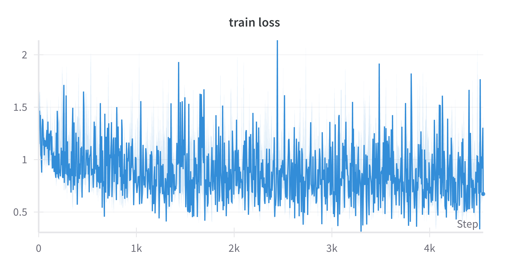
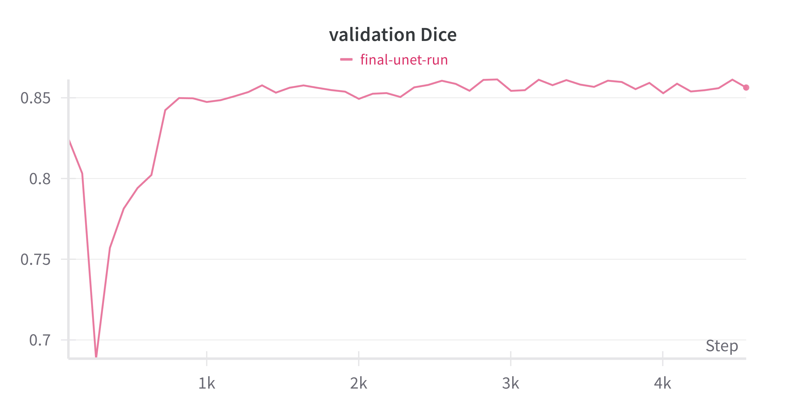
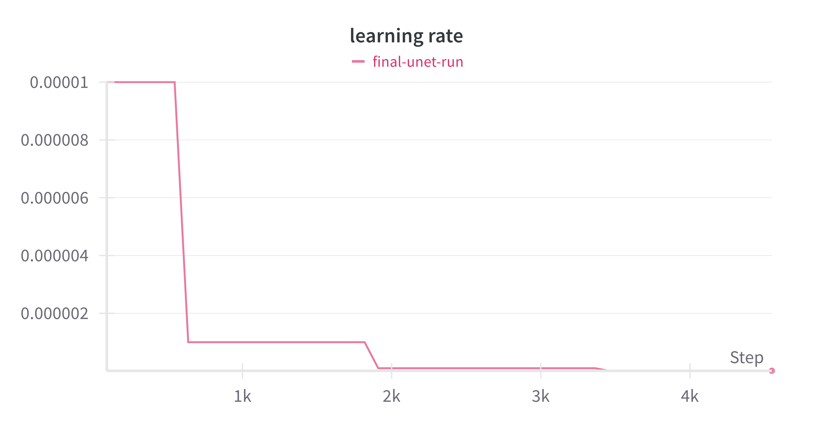

# U-Net Segmentation on Kvasir-SEG (In Progress)

This repository contains a biomedical image segmentation project using the U-Net architecture on the Kvasir-SEG dataset. The objective is to evaluate the impact of various data augmentation techniques on model performance, specifically focusing on Dice score, generalization, and inference robustness.

**Status**: Training completed. Evaluation and testing phase is currently in progress. Results and output masks will be added shortly.

---

## Dataset

- Kvasir-SEG: A high-quality gastrointestinal polyp segmentation dataset  
- [Dataset link](https://datasets.simula.no/kvasir-seg/)

---

## Model Architecture

- Model: U-Net  
- Framework: PyTorch  
- Loss Function: Dice + BCE (to be finalized)  
- Augmentation Techniques: Flip, rotate, crop, color jitter (experiments ongoing)

---

## Project Goals

- Build a strong U-Net baseline for medical image segmentation  
- Analyze the effect of augmentation on:
  - Dice Score
  - IoU
  - Generalization to unseen data  
- Visualize training metrics using Weights & Biases

---

## W&B Logs

Training logs and metrics are tracked via Weights & Biases.  
[View training run](https://wandb.ai/enggroshani-jha1818-university-of-new-haven/U-Net/runs/o1eo40l2?nw=nwuserenggroshanijha1818)

---

## Completed

- Dataset loading and preprocessing  
- U-Net implementation in PyTorch  
- Baseline training and wandb integration

---

## Visual Results

The following plots were exported from Weights & Biases (wandb)

**Training Loss**


**Validation Dice Score**


**Learning Rate Schedule**


## Coming Soon

- Model evaluation on validation/test set  
- Visualization of segmented masks  
- Post-processing: CRF, morphological operations  
- Paper submission (targeting medical AI conference/journal)

---

## Installation & Usage

```bash
git clone https://github.com/enggRosh/Kvasir-SEG-Unet-Augmentation-Study-Project.git
cd Kvasir-SEG-Unet-Augmentation-Study-Project/Pytorch-UNet
pip install -r requirements.txt
python train.py

```

Make sure you have access to the Kvasir-SEG dataset and update the data path in your script.

---

## Project Structure

This is the current structure of my U-Net segmentation project:

Kvasir-SEG-Unet-Augmentation-Study/

│── README.md               # Project overview and usage
├── train.py                 # Main training loop for U-Net
├── dataset.py              # Custom dataset loader with preprocessing
├── utils/                  # Dice score calculation and helper scripts
├── requirements.txt        # Python dependencies
├── graphs/                 # Exported training charts (Dice score, loss, etc.)
├── results/                # Post-processed masks and evaluation outputs will be added soon.


---

## Author

Roshani Kumari Jha  
West Haven, CT  
enggroshani.jha1818@gmail.com  
[LinkedIn](https://www.linkedin.com/in/enggroshani-jha/)

---

## License

This project is released under the MIT License. You are free to use, modify, and distribute for academic and research purposes.
